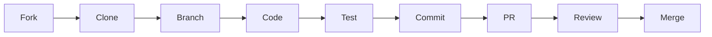

# Development Guide

This section contains resources for developers contributing to DDoS Inspector.

## 👨‍💻 Developer Resources

### 🤝 [Contributing Guide](contributing.md)
- Development workflow
- Coding standards
- Pull request process
- Community guidelines

### 📋 [API Reference](api-reference.md)
- Complete API documentation
- Class references
- Function documentation
- Code examples

### 🔧 Build System
- CMake configuration
- Compilation options
- Debug builds
- Testing setup

## 🚀 Quick Start for Developers

1. **Fork and Clone**
   ```bash
   git clone https://github.com/YOUR_USERNAME/ddos_inspector.git
   cd ddos_inspector
   ```

2. **Set Up Development Environment**
   ```bash
   sudo apt-get install -y build-essential cmake git libpcap-dev
   mkdir build-dev && cd build-dev
   cmake .. -DCMAKE_BUILD_TYPE=Debug
   make -j$(nproc)
   ```

3. **Run Tests**
   ```bash
   ./scripts/run_tests.sh
   make test
   ```

## 🏗️ Development Workflow



## 📚 Code Structure

```
src/                    # Source code
├── ddos_inspector.cpp  # Main plugin
├── stats_engine.cpp   # Statistical analysis
├── behavior_tracker.cpp # Attack detection
└── firewall_action.cpp # Mitigation

include/               # Header files
tests/                # Test suite
scripts/              # Build and deployment scripts
```

## 🧪 Testing

- **Unit Tests**: Component-level testing
- **Integration Tests**: End-to-end workflows  
- **Performance Tests**: Latency and throughput
- **Attack Simulations**: Realistic attack testing

## 📖 Coding Standards

- Follow Google C++ Style Guide
- Use meaningful variable names
- Document public APIs
- Write comprehensive tests
- Keep functions focused and small

## 🔗 Related Documentation

- [Architecture](../architecture/) - System design overview
- [Testing](../testing/) - Testing framework details
- [Configuration](../configuration/) - Configuration options

---

**Getting Started**: See the [Contributing Guide](contributing.md) for detailed development setup.